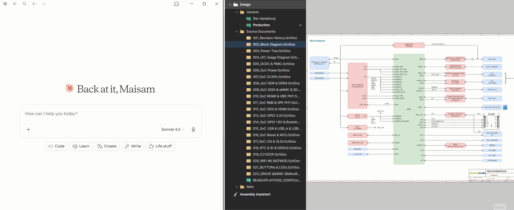

# PCB Copilot

[](https://github.com/ee-in-a-box/pcb-copilot/actions/workflows/ci.yml)
[](https://github.com/ee-in-a-box/pcb-copilot/releases)
[](LICENSE)
[]()

**Firmware, mechanical, and test engineers move faster when a PCB schematic doesn't require an EE to interpret it.**

pcb-copilot gives you schematic access inside Claude — no Altium license, no waiting on the EE to look something up. Your EE exports a snapshot with [altium-copilot](https://github.com/ee-in-a-box/altium-copilot) and shares one file. You open it and start asking questions.

Part of the [ee-in-a-box](https://github.com/ee-in-a-box) suite.



---

## What it does

| Who | They may ask... | What happens |
|---|---|---|
| **Firmware** | *"Which GPIO is connected to the enable pin on U5?"* | Traces the pin to its net, finds the MCU pin on the other end |
| | *"What's on SPI bus 3?"* | Lists every component whose chip-select, MOSI, MISO, or SCK lands on those nets |
| | *"Are there pull-ups on the I2C lines, and what value?"* | Finds the resistors on the SDA/SCL nets with their values |
| **Mechanical** | *"What's the pinout of J4?"* | Returns every pin number, signal name, and what it connects to |
| | *"Which connectors carry power?"* | Finds connectors with pins on power nets |
| **Test** | *"How do I get to the 5V rail for a probe?"* | Lists every pin on that net — connectors, test points, component legs |
| | *"Which part is most likely to fail first under a 40V surge on the input?"* | Pulls every component on that net with ratings from their datasheets |
| | *"What's not populated in the production variant?"* | Returns the full DNP list for the active build variant |


---

## Getting the snapshot file

pcb-copilot reads a `.db` file exported from [altium-copilot](https://github.com/ee-in-a-box/altium-copilot) — the schematic copilot for Altium Designer.

**Ask your EE to:**
1. Install altium-copilot and open the project in Altium
2. Tell Claude: *"Package this Altium project to share with the rest of the team"* or *"Export for sharing"*
3. Send you the `.db` file (it lives next to the `.PrjPcb`) — via Confluence, Slack or shared drive

That file is the snapshot pcb-copilot reads. Re-request it whenever the schematic changes significantly or after another PCB release.

If your EE also publishes the project to [Altium 365](https://www.altium.com/altium-365), you can open the schematic and PCB layout directly in a browser — no license needed. pcb-copilot and Altium 365 complement each other: use Altium 365 to visually trace a net on the board, and pcb-copilot to ask Claude questions about it.

---

## Requirements

- [Claude Desktop](https://claude.ai/download) or Claude Code — works with Pro and Enterprise subscriptions
- A `.db` snapshot from your EE (see above)

---

## Install

**Windows:**
```powershell
irm https://raw.githubusercontent.com/ee-in-a-box/pcb-copilot/main/install.ps1 | iex
```

**Mac:**
```bash
curl -fsSL https://raw.githubusercontent.com/ee-in-a-box/pcb-copilot/main/install.sh | bash
```

---

## Usage

Once installed, open Claude and tell it where your `.db` file is — or just ask a question and it will prompt you. After the first load the file is remembered across sessions.

---

## Privacy

The MCP server runs locally and doesn't log anything or phone home. Schematic data is sent only to Claude via your own Pro or Enterprise subscription — it never touches any other server.

---

## Contributing

See [CONTRIBUTING.md](CONTRIBUTING.md).

For bug reports and support, open an issue at [github.com/ee-in-a-box/pcb-copilot/issues](https://github.com/ee-in-a-box/pcb-copilot/issues).

---

## License

MIT © Maisam Pyarali
